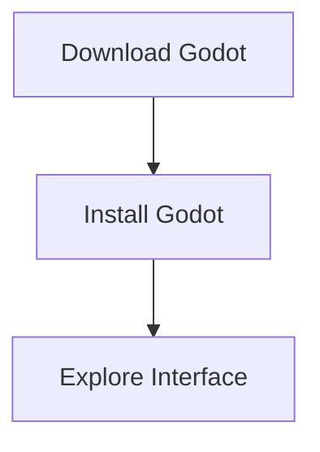
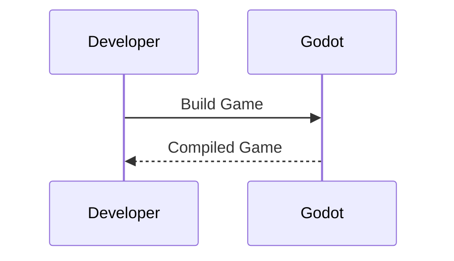

## Please note if you are viewing this it looks mostly like a full article but was only put here for testing

# Getting Started with Godot Game Engine

Are you ready to embark on your journey into game development? Look no further than the Godot Game Engine! In this comprehensive guide, we'll walk you through everything you need to know to get started with Godot, from installation to creating your first game.

## Introduction to Godot

Godot is a free and open-source game engine that empowers developers to create games for a variety of platforms, including PC, mobile, and web. With its intuitive interface, powerful features, and active community, Godot has become a popular choice for indie developers and professionals alike.

## Installing Godot

Getting started with Godot is easy! Simply visit the official website [godotengine.org](https://godotengine.org/) and download the latest version of the engine for your operating system. Once downloaded, follow the installation instructions provided on the website.

## Exploring the Interface

Upon launching Godot, you'll be greeted by a user-friendly interface designed to streamline the game development process. Take some time to familiarize yourself with the various panels, including the Scene, Inspector, and Node tabs. These panels will be your primary tools for building and organizing your game.

  

## Creating Your First Project

Now that you're acquainted with the interface, it's time to dive into creating your first project. Click on the "New Project" button and choose a location to save your project files. Next, give your project a name and select a template to start from. Godot offers several templates, including 2D, 3D, and empty projects, depending on your preferences and project requirements.

## Adding Scenes and Nodes

In Godot, games are built using scenes, which are comprised of nodes representing various game elements such as characters, objects, and environments. To add a new scene, simply right-click in the Scene panel and select "New Scene." Then, add nodes to your scene by dragging and dropping them from the Node tab onto the Scene panel.

## Scripting with GDScript

GDScript is Godot's built-in scripting language, designed to be easy to learn and use while offering powerful functionality. With GDScript, you can add interactivity, logic, and behavior to your game elements. To create a new script, select a node in your scene, click the "Add Script" button in the Inspector panel, and choose GDScript as the script type.

## Building and Running Your Game

Once you've created your scenes, added nodes, and scripted your game logic, it's time to build and run your game! Godot provides built-in tools for exporting your game to various platforms, including desktop, mobile, and web. Simply select the desired platform from the export menu and follow the on-screen instructions to generate a playable build of your game.

  

## Conclusion

Congratulations, you've taken your first steps into the exciting world of game development with Godot! By installing the engine, exploring the interface, creating scenes and nodes, scripting with GDScript, and building your game, you've laid the foundation for bringing your game ideas to life. So what are you waiting for? Dive in and start creating your masterpiece today!